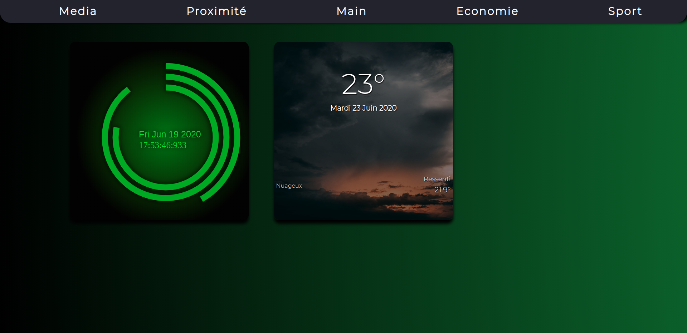
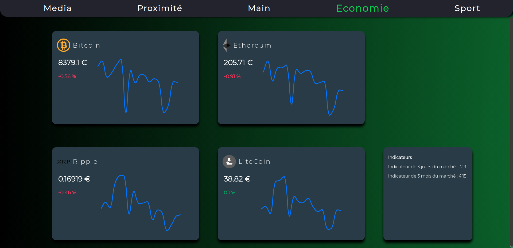
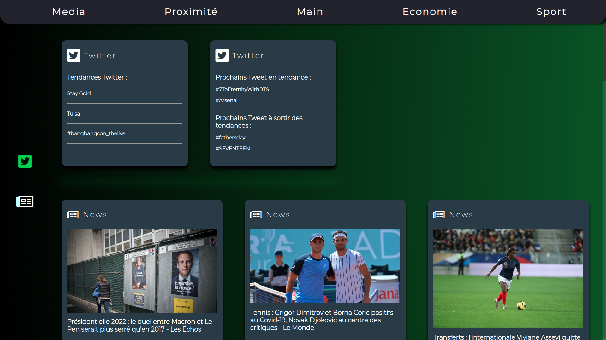
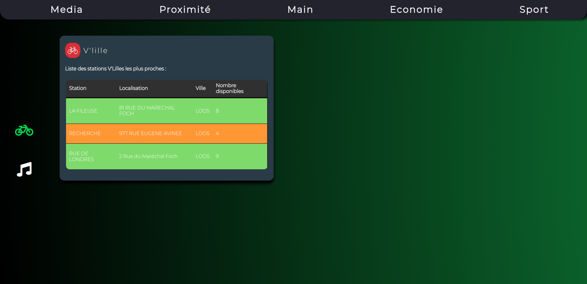
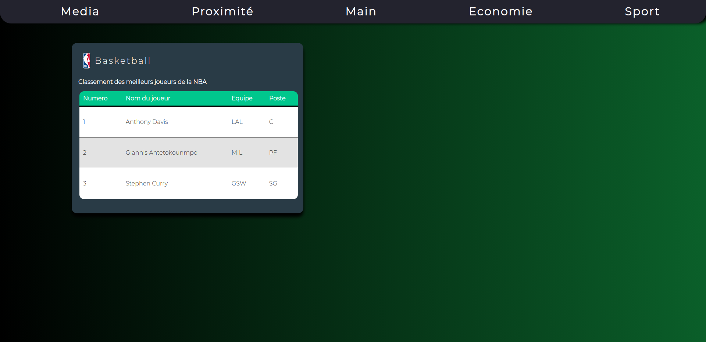

# MyDay,l'assistant web qu'il vous faut !

## Introduction

This app have been built in 1 month for an engineering school project at ISEN Lille by 6 students :

- Alex CAPOEN
- Hugo ERAUD-BERTHAUD
- Victor JUNG
- Loucas RODRIGUES
- Johan ROUX
- Louis WILLEMS

The app needs mongoDb and NodeJs to work properly, once you get the project you can start the app by running index.js with node.

```
node index.js
```

Then the app will be host in localhost:4200.

## Visuals

Here some visuals of the app.












